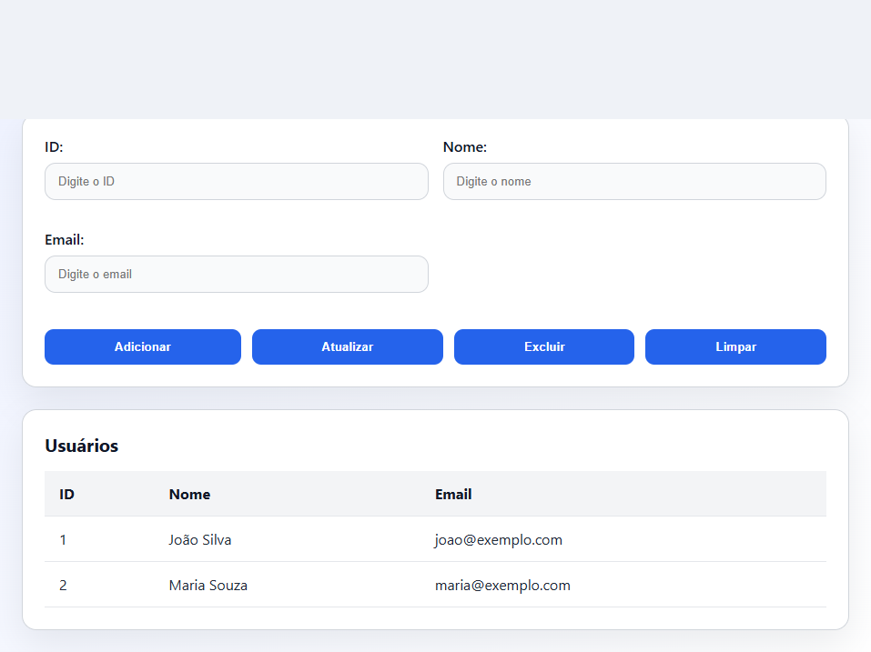

# JavaCrudApp

Projeto de exemplo com duas interfaces:
- Aplicação Java Swing para CRUD de usuários
- Página web estática com HTML, CSS e JavaScript para o mesmo fluxo

## Arquivos principais

- `src/com/example/crud/Main.java` — classe principal do app Java
- `src/com/example/crud/Usuario.java` — modelo de usuário
- `index.html` — interface web
- `styles.css` — estilos da página web
- `script.js` — lógica de interação da tabela
- `images/app-screenshot.png` — captura real do projeto

## Captura de tela



## Como executar a versão Java

Abra o terminal na pasta `C:\Users\Asus\JavaCrudApp` e execute:

```powershell
javac -d out src\com\example\crud\*.java
java -cp out com.example.crud.Main
```

## Como abrir a versão web

Simplesmente abra `index.html` no navegador ou use uma extensão como Live Server.

## Como iniciar o repositório Git local

1. Abra o terminal em `C:\Users\Asus\JavaCrudApp`
2. Inicialize o repositório:

```powershell
git init
```

3. Adicione os arquivos e faça o primeiro commit:

```powershell
git add .
git commit -m "Initial commit"
```

## Como publicar no GitHub

1. Crie um repositório no GitHub
2. Adicione o remote substituindo o valor abaixo:

```powershell
git remote add origin https://github.com/SEU_USUARIO/SEU_REPOSITORIO.git
git branch -M main
git push -u origin main
```

## Funcionalidades da página web

- Adicionar usuário
- Atualizar usuário selecionado
- Excluir usuário selecionado
- Limpar formulário
- Selecionar usuário na tabela para edição
